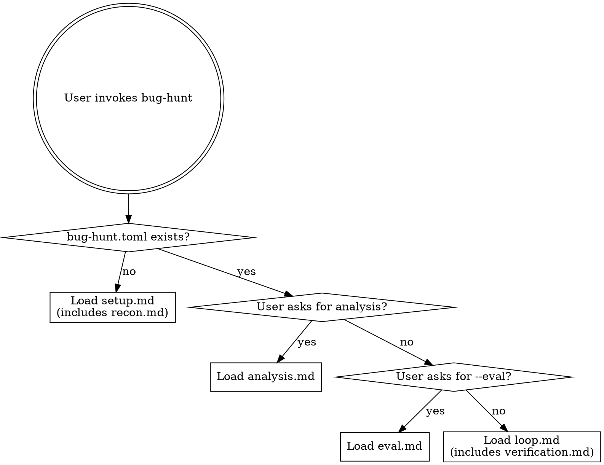

# bug-hunt: Autonomous Unit-Test Writing and Bug Finding

## Overview

Continuously write unit tests to discover bugs. The agent adds tests to increase coverage, finds bugs when tests fail, and records every finding — all running autonomously without ever modifying source code.

## When to Use

- User wants to continuously add unit tests and find bugs autonomously
- There is a test framework and test suite (or one can be bootstrapped)
- The codebase has low test coverage or known gaps
- The process should run autonomously without supervision
- Multiple agents can run in parallel, each covering a different module

## Routing

### First run (no config)

Follow `setup.md` to interactively configure the test commands, test framework, editable test scope, baseline, and code risk analysis. Setup uses `analysis-engine.md` for risk scoring and initializes `strategy-state.json`. After risk analysis, `recon.md` runs automatically to detect tech stack and entry points.

### Subsequent runs (config exists)

Follow `loop.md` to run the test-writing loop. Uses `adaptive-strategy.md` for analysis-driven test selection. The agent reads the config, risk map, recon report, strategy state, context note, and recent history, then enters the autonomous loop. After each `bug-found` result, `verification.md` runs to filter false positives.

### Analysis

Follow `analysis.md` when the user asks for a summary of results, tests written, bugs found, or recommendations.

### Evaluation

Follow `eval.md` when the user invokes `/bug-hunt --eval`. Runs the loop against a controlled test fixture with planted bugs to measure detection rate, false positive rate, and efficiency.

## Key Files

| File | Tracked in git? | Purpose |
|------|-----------------|---------|
| `bug-hunt.toml` | Yes | Configuration: test commands, framework, scope, timeouts |
| `bug-hunt-context.md` | Yes | Agent's living knowledge base: coverage gaps, known bugs |
| `risk-map.json` | Yes | Code risk scores per function (generated by analysis-engine.md) |
| `strategy-state.json` | Yes | Test type weights and bug patterns (updated by adaptive-strategy.md) |
| `recon-report.json` | Yes | Tech stack, entry points, trust boundaries (generated by recon.md) |
| `results.tsv` | No (gitignored) | Structured log of tests written and bugs found |
| `recon.md` | Yes | Codebase reconnaissance: tech stack, entry points, trust boundaries |
| `verification.md` | Yes | Bug verification and false-positive filtering |
| `eval.md` | Yes | Self-test evaluation and effectiveness benchmarking |
| `llms.txt` | Yes | Short LLM-facing project summary |
| `llms-full.txt` | Yes | Full LLM-facing reference |

## Quick Reference

- **test-added**: new unit test(s) written and all existing tests still pass
- **bug-found**: new test(s) written that expose a bug (test fails, confirming the bug exists)
- **crash**: test command failed to run — fix if trivial, skip if fundamental
- **Branch**: `bug-hunt/<tag>` — each attempt is a commit on the agent's dedicated branch
