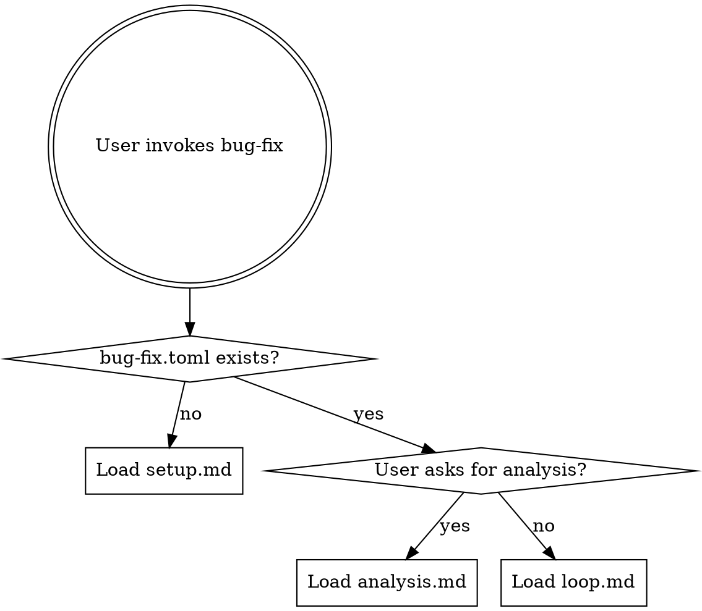

# bug-fix: Autonomous Unit-Test Writing and Bug Fixing

## Overview

Continuously write unit tests to discover bugs and fix them. The agent adds tests to increase coverage, finds bugs when tests fail, proposes fixes, and keeps fixes that pass — all running autonomously.

## When to Use

- User wants to continuously add unit tests and fix bugs autonomously
- There is a test framework and test suite (or one can be bootstrapped)
- The codebase has low test coverage or known gaps
- The process should run autonomously without supervision

## Routing

### First run (no config)

Follow `setup.md` to interactively configure the test commands, test framework, editable scope, baseline, and code risk analysis. Setup uses `analysis-engine.md` for risk scoring and initializes `strategy-state.json`.

### Subsequent runs (config exists)

Follow `loop.md` to run the test-writing and bug-fixing loop. Uses `adaptive-strategy.md` for analysis-driven test selection. The agent reads the config, risk map, strategy state, context note, and recent history, then enters the autonomous loop.

### Analysis

Follow `analysis.md` when the user asks for a summary of results, tests written, bugs fixed, or recommendations.

## Key Files

| File | Tracked in git? | Purpose |
|------|-----------------|---------|
| `bug-fix.toml` | Yes | Configuration: test commands, framework, scope, timeouts |
| `bug-fix-context.md` | Yes | Agent's living knowledge base: coverage gaps, known bugs, what works |
| `risk-map.json` | Yes | Code risk scores per function (generated by analysis-engine.md) |
| `strategy-state.json` | Yes | Test type weights and bug patterns (updated by adaptive-strategy.md) |
| `results.tsv` | No (gitignored) | Structured log of tests written, bugs found, and fixes attempted |

## Quick Reference

- **test-added**: new unit test(s) written and all existing tests still pass
- **bug-found**: new test(s) written that expose a bug (test fails, confirming the bug exists)
- **fixed**: bug fix applied and all tests pass (including the new test that found the bug)
- **not-fixed**: fix didn't resolve the bug or tests still fail
- **regression**: fix caused previously passing tests to fail
- **crash**: test command failed to run — fix if trivial, skip if fundamental
- **Branch**: `bug-fix/<tag>` — each attempt is a commit, discards are `git reset --hard`
