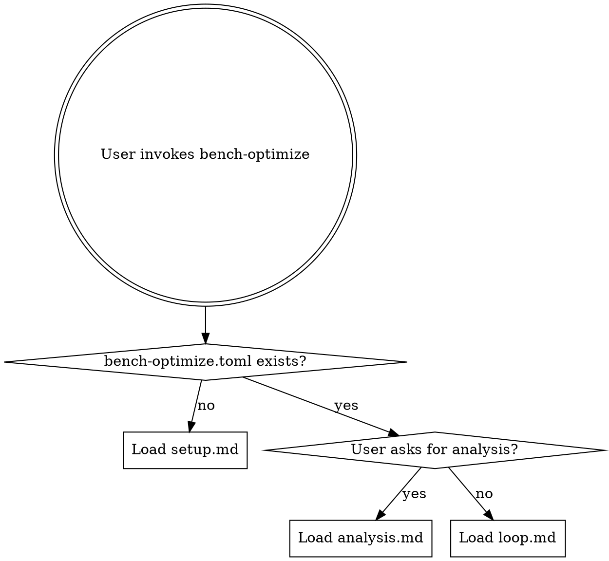

# bench-optimize: Autonomous Benchmark Optimization

## Overview

Continuously optimize a program's benchmark score by proposing code changes, running benchmarks, and keeping improvements.

## When to Use

- User wants to optimize a program's performance (runtime, throughput, memory, etc.)
- There is a measurable, reproducible benchmark
- The optimization process should run autonomously

## Routing

### First run (no config)

Follow `setup.md` to interactively configure the benchmark, editable scope, and baseline.

### Subsequent runs (config exists)

Follow `loop.md` to run the experiment loop. The agent reads the config, context note, and recent history, then enters the autonomous optimization loop.

### Analysis

Follow `analysis.md` when the user asks for a summary of results, progress charts, or recommendations.

## Key Files

| File | Tracked in git? | Purpose |
|------|-----------------|---------|
| `bench-optimize.toml` | Yes | Configuration: benchmark command, metric, scope, thresholds |
| `bench-optimize-context.md` | Yes | Agent's living knowledge base: what works, what doesn't, ideas |
| `results.tsv` | No (gitignored) | Structured experiment log with metrics and descriptions |

## Quick Reference

- **Keep** a change: metric improved beyond variance threshold
- **Discard** a change: metric equal, worse, or within noise
- **Crash**: benchmark failed to run — fix if trivial, skip if fundamental
- **Branch**: `bench-optimize/<tag>` — each experiment is a commit, discards are `git reset --hard`
