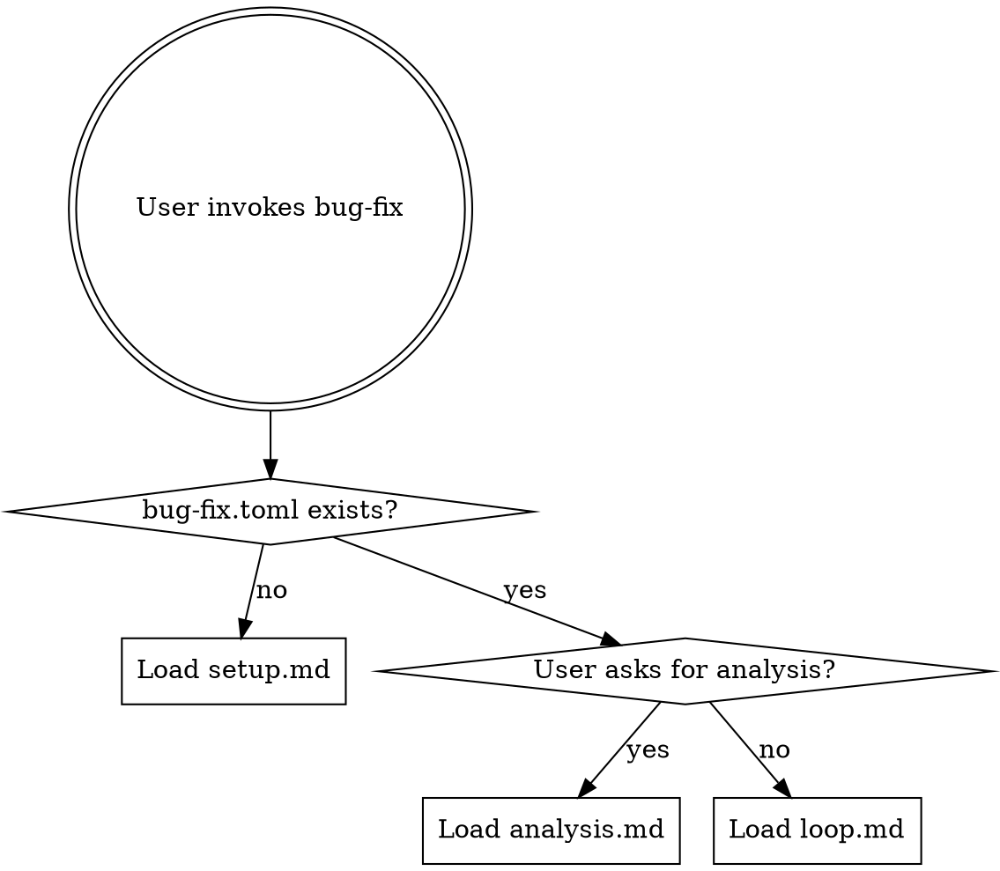

# bug-fix: Autonomous Bug-Hunting and Fixing

## Overview

Continuously find and fix bugs by proposing code fixes, running tests and linters, and keeping fixes that pass while discarding those that fail or introduce regressions.

## When to Use

- User wants to find and fix bugs autonomously
- There is a test suite, linter, or other bug detection tool
- The process should run autonomously without supervision

## Routing

### First run (no config)

Follow `setup.md` to interactively configure the bug detection commands, editable scope, and baseline.

### Subsequent runs (config exists)

Follow `loop.md` to run the bug-hunting loop. The agent reads the config, context note, and recent history, then enters the autonomous fix loop.

### Analysis

Follow `analysis.md` when the user asks for a summary of results, fixed bugs, or recommendations.

## Key Files

| File | Tracked in git? | Purpose |
|------|-----------------|---------|
| `bug-fix.toml` | Yes | Configuration: detection commands, metric, scope, timeouts |
| `bug-fix-context.md` | Yes | Agent's living knowledge base: what works, what doesn't, known bugs |
| `results.tsv` | No (gitignored) | Structured fix log with bug counts and descriptions |

## Quick Reference

- **fixed**: fix applied and all detection commands pass
- **not-fixed**: fix didn't resolve the bug or detection commands still fail
- **regression**: fix caused previously passing tests to fail
- **crash**: detection command failed to run — fix if trivial, skip if fundamental
- **Branch**: `bug-fix/<tag>` — each fix attempt is a commit, discards are `git reset --hard`
