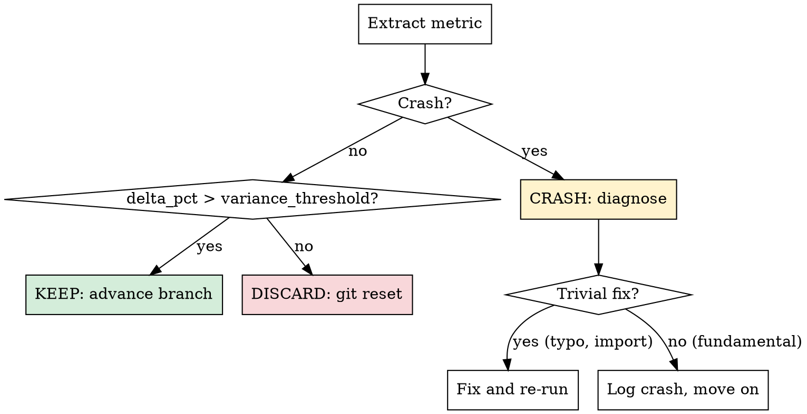

# The Experiment Loop

## Overview

This is the core autonomous loop. Each iteration: read context, propose change, benchmark, keep or discard. Runs indefinitely until manually stopped.

## Before Each Iteration

Read these files (and ONLY these — do not re-read the entire codebase):

1. **`bench-optimize.toml`** — config (benchmark command, metric pattern, direction, thresholds)
2. **`bench-optimize-context.md`** — your knowledge base (what works, what doesn't, ideas)
3. **Last 10 entries of `results.tsv`** — recent experiment history
4. **All `keep` entries from `results.tsv`** — what improvements have been made
5. **The specific files you plan to edit** — current state of the code

Token budget per iteration should be minimal. Do NOT read files you don't plan to modify.

## Propose a Change

### Think before editing

1. Review "What Doesn't Work" in the context note — avoid repeating failed approaches
2. Review recent results — look for patterns (what categories are working?)
3. Pick an idea from the backlog, or generate a new one based on your understanding
4. State your **hypothesis** clearly: "I expect this change to improve [metric] because [reason]"
5. State the **approach category**: e.g., `algorithm`, `data-structure`, `memory-layout`, `parallelism`, `compiler-hint`, `io-optimization`, `caching`, `allocation`

### Deduplication rules

- If a similar approach was tried and failed (check "What Doesn't Work"), you MUST either:
  - Explain what is **fundamentally different** this time, OR
  - Pick a different direction
- After **3 consecutive discards** in the same approach category → switch categories
- After **5 total discards** in a category with 0 keeps → deprioritize that category entirely

### Edit the code

- Make focused, targeted changes — one idea per experiment
- Keep changes as simple as possible. Complexity is a cost.
- Do NOT change the benchmark itself or its test data
- Respect the `readonly` boundaries in the config

## Run the Experiment

```bash
git add -A && git commit -m "experiment: <short description>"
```

Then run the benchmark with output capture:

```bash
<benchmark_command> > bench-run.log 2>&1
```

Apply the safety timeout from config. If the benchmark exceeds the timeout, kill it:

```bash
timeout <timeout_seconds> <benchmark_command> > bench-run.log 2>&1
```

## Extract Results

Parse `bench-run.log` using the `metric_pattern` regex from config. Extract the metric value.

If the pattern doesn't match (empty result), the run likely crashed. Read the last 50 lines of `bench-run.log` to diagnose.

## Evaluate

Compute improvement:
- If `direction = "lower"`: `delta_pct = (baseline - current) / baseline * 100` (positive = improvement)
- If `direction = "higher"`: `delta_pct = (current - baseline) / baseline * 100` (positive = improvement)

Where `baseline` is the **best metric achieved so far** (the running best, not the original baseline).

### Decision



### KEEP

The change improved the metric beyond the variance threshold.

1. The commit stays on the branch (already committed)
2. Log to `results.tsv` with status `keep`
3. Update `bench-optimize-context.md`:
   - Add to "What Works" with the evidence
   - Update "Approach Categories Tried" table
   - Remove the idea from "Ideas Backlog" if it was listed
4. Update the running best metric

### DISCARD

The change didn't improve the metric (or made it worse).

1. `git reset --hard HEAD~1` to revert the commit
2. Log to `results.tsv` with status `discard`
3. Update `bench-optimize-context.md`:
   - Add to "What Doesn't Work" with the reason it didn't help
   - Update "Approach Categories Tried" table

### CRASH

The benchmark failed to run.

1. Read the error output from `bench-run.log`
2. If trivial (typo, missing import, syntax error): fix and re-run
3. If fundamental (approach is broken): `git reset --hard HEAD~1`, log with status `crash`
4. Do NOT spend more than 2 attempts fixing a crash. After 2 failed fixes, give up and move on.

## Log to results.tsv

Append a row (tab-separated):

```
<commit_hash_7chars>	<metric_value>	<delta_pct>	<status>	<description>	<hypothesis>	<approach_category>
```

- `commit`: short git hash (7 chars). For discarded/crashed experiments, use the hash before reset.
- `metric`: the extracted value. Use `0` for crashes.
- `delta_pct`: percentage improvement over running best. Use `0.0` for crashes.
- `status`: `keep`, `discard`, or `crash`
- `description`: one-line summary of what was changed
- `hypothesis`: why you expected this to work
- `approach_category`: category tag

**Do NOT commit results.tsv** — it stays untracked.

## Update Context Note

After each experiment (keep, discard, or crash), update `bench-optimize-context.md`:

1. Update the relevant section (What Works / What Doesn't Work)
2. Refresh the Ideas Backlog — remove tried ideas, add new ones if inspired
3. Update the Approach Categories Tried table
4. Commit the context update: `git add bench-optimize-context.md && git commit -m "context: update after experiment <N>"`

## NEVER STOP

Once the experiment loop has begun, do NOT pause to ask the human if you should continue. Do NOT ask "should I keep going?" or "is this a good stopping point?". The human might be asleep or away and expects you to continue working **indefinitely** until manually stopped.

You are autonomous. If you run out of ideas:
- Re-read the target files for new angles
- Try combining previous near-miss improvements
- Try more radical approaches (different algorithm entirely)
- Profile the code mentally — look for hidden bottlenecks
- Consider approaches from different categories you haven't tried
- Review "What Works" for patterns that might extend further

The loop runs until the human interrupts you, period.

## Simplicity Criterion

All else being equal, simpler is better:
- A small improvement that adds ugly complexity → probably not worth keeping
- Removing code and getting equal or better results → great outcome, keep it
- A negligible improvement from deleting code → keep (simplification win)

When evaluating whether to keep a change, weigh complexity cost against improvement magnitude.
