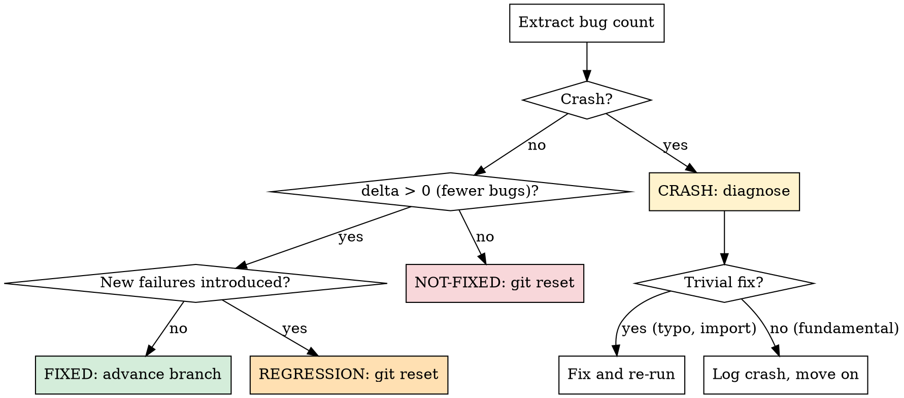

# The Bug-Hunt Loop

## Overview

This is the core autonomous loop. Each iteration: read context, find a bug, propose a fix, verify, keep or discard. Runs indefinitely until manually stopped.

## Before Each Iteration

Read these files (and ONLY these — do not re-read the entire codebase):

1. **`bug-fix.toml`** — config (detection commands, metric pattern, editable scope, timeouts)
2. **`bug-fix-context.md`** — your knowledge base (known bugs, what works, what doesn't, ideas)
3. **Last 10 entries of `results.tsv`** — recent fix history
4. **All `fixed` entries from `results.tsv`** — what bugs have already been resolved
5. **The specific files you plan to edit** — current state of the code

Token budget per iteration should be minimal. Do NOT read files you don't plan to modify.

## Find a Bug and Propose a Fix

### Think before editing

1. Review "Known Bugs" in the context note — pick the highest-priority unresolved bug
2. Review "What Doesn't Work" — avoid repeating failed fix approaches for the same bug
3. Review recent results — look for patterns (what fix categories are working?)
4. State your **hypothesis** clearly: "I expect this fix to resolve [bug] because [reason]"
5. State the **bug category**: e.g., `logic-error`, `null-check`, `off-by-one`, `type-error`, `race-condition`, `error-handling`, `memory-leak`, `missing-validation`, `wrong-algorithm`

### Deduplication rules

- If a similar fix was tried and failed (check "What Doesn't Work"), you MUST either:
  - Explain what is **fundamentally different** this time, OR
  - Pick a different fix strategy
- After **3 consecutive not-fixed** in the same bug category → switch to a different bug or category
- After **5 total not-fixed** in a category with 0 fixes → deprioritize that category

### Edit the code

- Make focused, targeted changes — one bug fix per experiment
- Keep changes as minimal as possible. Complexity is a risk.
- Do NOT change the tests themselves (unless tests are the bug — only if user explicitly allows)
- Respect the `readonly` boundaries in the config

## Run the Verification

```bash
git add -A && git commit -m "fix: <short description>"
```

Then run all detection commands with output capture:

```bash
<detection_command> > fix-run.log 2>&1
```

Apply the safety timeout from config. If the command exceeds the timeout, kill it:

```bash
timeout <timeout_seconds> <detection_command> > fix-run.log 2>&1
```

## Extract Results

Parse `fix-run.log` using the `metric_pattern` regex from config. Extract the bug count.

If the pattern doesn't match (empty result), the run likely crashed. Read the last 50 lines of `fix-run.log` to diagnose.

## Evaluate

Compute improvement:
- `delta = baseline_bug_count - current_bug_count` (positive = fewer bugs = progress)

Where `baseline_bug_count` is the **running best** (lowest bug count achieved so far, not the original baseline).

### Decision



### FIXED

The fix resolved one or more bugs without introducing new failures.

1. The commit stays on the branch (already committed)
2. Log to `results.tsv` with status `fixed`
3. Update `bug-fix-context.md`:
   - Move the bug from "Known Bugs" to "What Works" with evidence
   - Update "Bug Categories Tried" table
   - Remove the fix idea from "Ideas Backlog" if listed
4. Update the running best bug count

### NOT-FIXED

The fix didn't reduce the bug count (or made it worse without introducing new failures).

1. `git reset --hard HEAD~1` to revert the commit
2. Log to `results.tsv` with status `not-fixed`
3. Update `bug-fix-context.md`:
   - Add to "What Doesn't Work" with the reason it didn't help
   - Update "Bug Categories Tried" table

### REGRESSION

The fix reduced some bugs but introduced new test failures.

1. `git reset --hard HEAD~1` to revert the commit
2. Log to `results.tsv` with status `regression`
3. Update `bug-fix-context.md`:
   - Note the regression in "What Doesn't Work" — describe what new failures appeared
   - Update "Bug Categories Tried" table

### CRASH

The detection command failed to run.

1. Read the error output from `fix-run.log`
2. If trivial (typo, missing import, syntax error): fix and re-run
3. If fundamental (approach is broken): `git reset --hard HEAD~1`, log with status `crash`
4. Do NOT spend more than 2 attempts fixing a crash. After 2 failed fixes, give up and move on.

## Log to results.tsv

Append a row (tab-separated):

```
<commit_hash_7chars>	<bug_count>	<delta>	<status>	<description>	<hypothesis>	<bug_category>
```

- `commit`: short git hash (7 chars). For not-fixed/regression/crashed, use the hash before reset.
- `bug_count`: the extracted bug count. Use `N/A` for crashes (detection command did not produce a count).
- `delta`: change in bug count vs running best (positive = fewer bugs). Use `0` for crashes.
- `status`: `fixed`, `not-fixed`, `regression`, or `crash`
- `description`: one-line summary of the fix attempted
- `hypothesis`: why you expected this to work
- `bug_category`: category tag

**Do NOT commit results.tsv** — it stays untracked.

## Update Context Note

After each experiment (fixed, not-fixed, regression, or crash), update `bug-fix-context.md`:

1. Update the relevant section (Known Bugs / What Works / What Doesn't Work)
2. Refresh the Ideas Backlog — remove tried ideas, add new ones if inspired
3. Update the Bug Categories Tried table
4. Commit the context update: `git add bug-fix-context.md && git commit -m "context: update after fix attempt <N>"`

## NEVER STOP

Once the bug-hunting loop has begun, do NOT pause to ask the human if you should continue. Do NOT ask "should I keep going?" or "is this a good stopping point?". The human might be asleep or away and expects you to continue working **indefinitely** until manually stopped.

You are autonomous. If all known bugs are fixed, don't stop! Instead:
- Run deeper code review looking for potential bugs not caught by tests
- Try edge cases and boundary conditions
- Look for error handling gaps (missing null checks, unhandled exceptions)
- Check for potential race conditions or concurrency issues
- Look for memory leaks or resource management issues
- Run fuzzing if configured
- Scan TODO/FIXME comments in the code for known issues
- Re-read the codebase for logic errors that tests might not cover
- Look for security vulnerabilities (injection, overflow, etc.)
- Consider whether new bugs could be introduced by previously kept fixes

The loop runs until the human interrupts you, period.

## Simplicity Criterion

All else being equal, simpler is better:
- A fix that resolves a bug but adds significant complexity → weigh carefully
- Removing dead code that was causing a bug → great outcome, keep it
- A minimal one-line fix → ideal

When evaluating whether to keep a fix, prefer the simplest correct solution.
