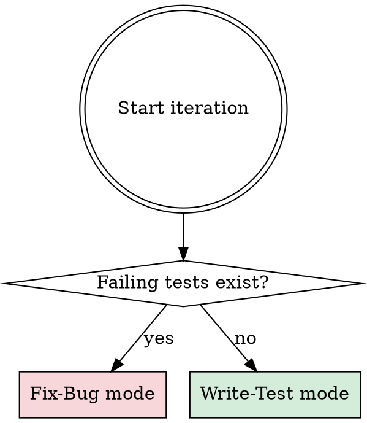
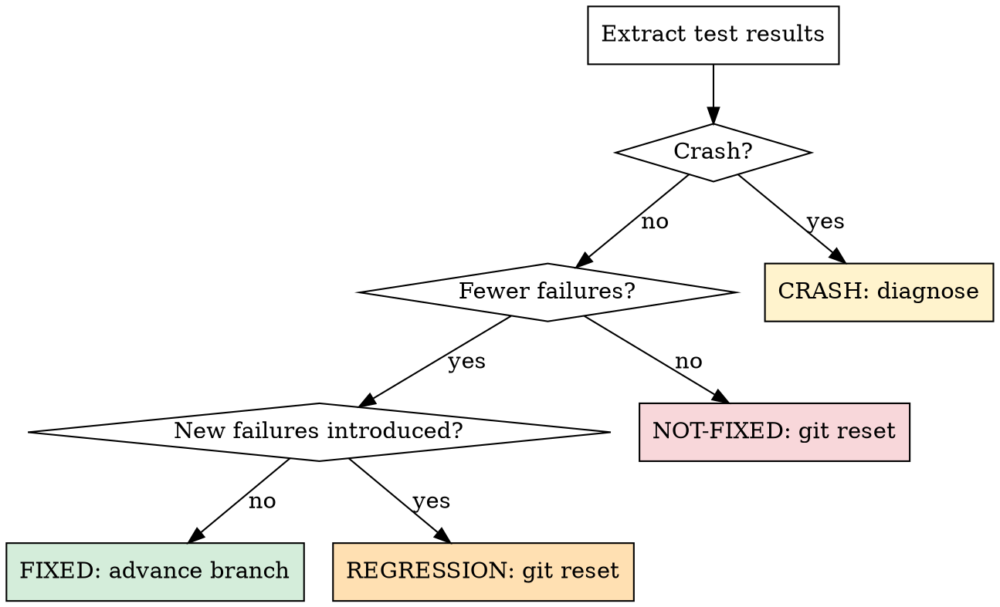

# The Test & Fix Loop

## Overview

This is the core autonomous loop with two alternating modes:

1. **Write-Test**: Add new unit tests to increase coverage and expose hidden bugs
2. **Fix-Bug**: Fix bugs found by the new or existing tests

Each iteration: read context → decide mode → write test or fix bug → verify → keep or discard. Runs indefinitely until manually stopped.

## Before Each Iteration

Read these files (and ONLY these — do not re-read the entire codebase):

1. **`bug-fix.toml`** — config (test commands, framework, editable scope, timeouts)
2. **`bug-fix-context.md`** — your knowledge base (coverage gaps, known bugs, what works/doesn't)
3. **`risk-map.json`** — code risk scores per function (if exists; generate if missing)
4. **`strategy-state.json`** — test type weights and bug patterns
5. **Last 10 entries of `results.tsv`** — recent history
6. **All `fixed` and `test-added` entries from `results.tsv`** — what's been accomplished
7. **The specific files you plan to edit** — current state of the code

Token budget per iteration should be minimal. Do NOT read files you don't plan to modify.

**If `risk-map.json` is missing:** Generate it now by following `analysis-engine.md`. Read all editable source files, score each function, write the map. This only happens once.

## Decide: Write Test or Fix Bug?



**Priority rule**: If there are known failing tests, fix them first. If all tests pass, write new tests. This ensures the codebase stays healthy while coverage grows.

---

## Mode A: Write-Test

### Think before writing

Use analysis-driven selection to pick the highest-value test target:

1. **Read risk-map.json** — get function risk scores (0-10)
2. **Read strategy-state.json** — get test type weights (0.2-3.0)
3. **Read last 10 results.tsv entries** — avoid repeating recently tested functions
4. **Calculate composite score** for each candidate (function, test_type):

```
score = (risk_score / 10) × 0.4 + (weight / 3.0) × 0.35 + novelty_bonus × 0.25
```

   - **risk_score**: from risk-map.json, normalized to 0-1
   - **weight**: from strategy-state.json, normalized to 0-1
   - **novelty_bonus**: 1.0 if function never tested, ×0.7 per previous test on same function, min 0.1

5. **Select highest-scoring** (function, test_type) pair
6. **Check bug patterns** in strategy-state.json — if the target function matches a recorded pattern, boost that test type
7. **State your hypothesis**: "I'm adding [test_type] tests for [function] because [risk reason + pattern match]"
8. **State the test category**: must match one of the types in strategy-state.json

### Write the test

- Follow the project's test framework conventions (from `bug-fix.toml`)
- Place test files in the configured `test_dir` using the project's naming conventions
- Each test should be focused — test one thing
- Write tests that are **likely to expose bugs**: edge cases, error paths, boundary conditions, null/empty inputs
- Do NOT modify source code in this mode — only add/modify test files

### Commit and run

```bash
git add -A && git commit -m "test: <short description>"
```

Run the test command:

```bash
timeout <timeout_seconds> <test_command> > test-run.log 2>&1
```

### Evaluate Write-Test result

Three possible outcomes:

#### TEST-ADDED (all tests pass including new ones)

The new test(s) pass — the code is correct for these cases. Good: coverage increased.

1. The commit stays on the branch
2. Log to `results.tsv` with status `test-added`
3. Update `bug-fix-context.md`:
   - Remove the coverage gap from "Test Coverage Gaps"
   - Note in "What Works" what was tested
   - Update "Categories Tried" table
4. **Next iteration**: continue writing more tests

#### BUG-FOUND (new test fails, proving a bug exists)

The new test fails — it exposed a real bug! This is a great outcome.

1. The commit stays on the branch (the failing test is intentional — it proves the bug)
2. Log to `results.tsv` with status `bug-found`
3. Update `bug-fix-context.md`:
   - Add the bug to "Known Bugs" with the failing test as evidence
   - Note what the test covers
4. **Next iteration**: switch to Fix-Bug mode to fix this bug

#### CRASH (test command fails to run)

1. Read the error output from `test-run.log`
2. If trivial (syntax error in test, import issue): fix and re-run
3. If fundamental: `git reset --hard HEAD~1`, log with status `crash`
4. Do NOT spend more than 2 attempts fixing a crash.

---

## Mode B: Fix-Bug

### Think before editing

1. Review "Known Bugs" in the context note — pick the highest-priority unresolved bug
2. Review "What Doesn't Work" — avoid repeating failed fix approaches
3. Review recent results — look for patterns (what fix categories are working?)
4. State your **hypothesis**: "I expect this fix to resolve [bug] because [reason]"
5. State the **bug category**: e.g., `logic-error`, `null-check`, `off-by-one`, `type-error`, `race-condition`, `error-handling`, `memory-leak`, `missing-validation`, `wrong-algorithm`

### Deduplication rules

- If a similar fix was tried and failed (check "What Doesn't Work"), you MUST either:
  - Explain what is **fundamentally different** this time, OR
  - Pick a different fix strategy
- After **3 consecutive not-fixed** in the same bug category → switch to a different bug or category
- After **5 total not-fixed** in a category with 0 fixes → deprioritize that category

### Edit the source code

- Make focused, targeted changes — one bug fix per experiment
- Keep changes as minimal as possible. Complexity is a risk.
- Only modify source files (not test files) in this mode
- Respect the `readonly` boundaries in the config

### Commit and run

```bash
git add -A && git commit -m "fix: <short description>"
```

Run all test/detection commands:

```bash
timeout <timeout_seconds> <test_command> > fix-run.log 2>&1
```

### Evaluate Fix-Bug result



#### FIXED

The fix resolved one or more bugs without introducing new failures.

1. The commit stays on the branch (already committed)
2. Log to `results.tsv` with status `fixed`
3. Update `bug-fix-context.md`:
   - Move the bug from "Known Bugs" to "What Works" with evidence
   - Update "Categories Tried" table
   - Remove the fix idea from "Ideas Backlog — Bugs to Fix" if listed
4. Update the running best (lowest failing test count)

#### NOT-FIXED

The fix didn't reduce the failure count (or made it worse without introducing new failures).

1. `git reset --hard HEAD~1` to revert the commit
2. Log to `results.tsv` with status `not-fixed`
3. Update `bug-fix-context.md`:
   - Add to "What Doesn't Work" with the reason it didn't help
   - Update "Categories Tried" table

#### REGRESSION

The fix reduced some bugs but introduced new test failures.

1. `git reset --hard HEAD~1` to revert the commit
2. Log to `results.tsv` with status `regression`
3. Update `bug-fix-context.md`:
   - Note the regression in "What Doesn't Work" — describe what new failures appeared
   - Update "Categories Tried" table

#### CRASH

The test command failed to run.

1. Read the error output from `fix-run.log`
2. If trivial (typo, missing import, syntax error): fix and re-run
3. If fundamental: `git reset --hard HEAD~1`, log with status `crash`
4. Do NOT spend more than 2 attempts fixing a crash.

---

## Log to results.tsv

Append a row (tab-separated):

```
<commit_hash_7chars>	<type>	<tests_total>	<tests_failing>	<delta>	<status>	<description>	<hypothesis>	<category>
```

- `commit`: short git hash (7 chars). For discarded attempts, use the hash before reset.
- `type`: `write-test` or `fix-bug`
- `tests_total`: total number of tests after this iteration
- `tests_failing`: number of failing tests. Use `N/A` for crashes.
- `delta`: change in failing tests vs running best (positive = fewer failures). Use `0` for crashes.
- `status`: `test-added`, `bug-found`, `fixed`, `not-fixed`, `regression`, or `crash`
- `description`: one-line summary of the test written or fix attempted
- `hypothesis`: why you wrote this test or expected this fix to work
- `category`: category tag

**Do NOT commit results.tsv** — it stays untracked.

## Update Context Note

After each iteration (regardless of outcome), update `bug-fix-context.md`:

1. Update the relevant section (Test Coverage Gaps / Known Bugs / What Works / What Doesn't Work)
2. Refresh both Ideas Backlogs — remove tried ideas, add new ones if inspired
3. Update the Categories Tried table
4. Commit the context update: `git add bug-fix-context.md && git commit -m "context: update after iteration <N>"`

## Update Strategy State

After each iteration, update `strategy-state.json` (see `adaptive-strategy.md` for details):

1. Read `strategy-state.json`
2. Identify the test type used in this iteration
3. Update counters:
   - `bug-found` → increment `bugs_found` for that type
   - `test-added` → increment `written` for that type
4. Recalculate weight: `new = old × (1 + 0.3 × (rate - avg_rate))`, clamp to [0.2, 3.0]
5. If `bug-found`: extract bug pattern, add to `bug_patterns` or increment count
6. Update `total_tests_written` and `total_bugs_found`
7. Set `last_updated` to current iteration number
8. Commit: `git add strategy-state.json && git commit -m "strategy: update after iteration <N>"`

**Stagnation check:** If last 20 iterations were all `test-added` (no bugs found), reset all weights to 1.0 and note in `bug-fix-context.md`.

## NEVER STOP

Once the loop has begun, do NOT pause to ask the human if you should continue. Do NOT ask "should I keep going?" or "is this a good stopping point?". The human might be asleep or away and expects you to continue working **indefinitely** until manually stopped.

You are autonomous. The two modes keep you busy forever:

**When all tests pass → write more tests:**
- Find untested functions, methods, or modules
- Test edge cases: empty inputs, null values, boundary conditions, overflow
- Test error paths: what happens when things go wrong?
- Test concurrency: race conditions, deadlocks (if applicable)
- Test integration points: how components interact
- Look for missing validation: bad inputs, malformed data
- Check TODO/FIXME comments for known issues to write tests for
- Review code for complex logic that deserves test coverage
- Write regression tests for previously fixed bugs to prevent them from returning

**When tests fail → fix the bugs:**
- Fix the bugs exposed by your tests
- Fix bugs exposed by linters or static analysis
- Look for related bugs in similar code patterns

The loop runs until the human interrupts you, period.

## Simplicity Criterion

All else being equal, simpler is better:
- A fix that resolves a bug but adds significant complexity → weigh carefully
- Removing dead code that was causing a bug → great outcome, keep it
- A minimal one-line fix → ideal
- Tests should be clear and readable — test one thing per test function
- Prefer descriptive test names that explain what is being tested

When evaluating whether to keep a change, prefer the simplest correct solution.
